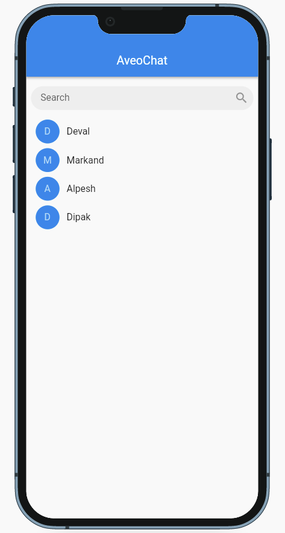
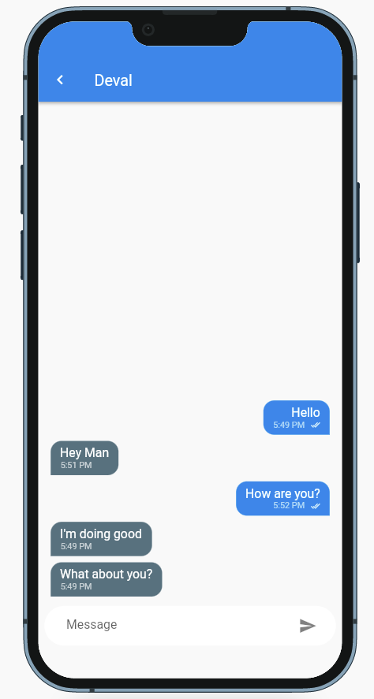

# AveoChat

AveoChat is one stop solution to integrate a chatting module to your project. Just with few configurations, you can get AveoChat module to work within your existing project.

<br>

# Getting Started
- [Supported Backend Services](#supported-backend-services)
- [Screenshots](#screenshots)
- [Platform Setup](#platform-setup)
- [Usage](#usage)
    - [Step 1 : Initialize AveoChat's configuration in your main() function](#step-1--initialize-aveochats-configuration-in-your-main-function)
    - [Step 2 : Add a condition to check if user is logged in & place below code to execute](#step-2--add-a-condition-to-check-if-user-is-logged-in--place-below-code-to-execute)
    - [Full Example of main() function (Combining step 1 & step 2)](#full-example-of-main-function-combining-step-1--step-2)
    - [Step 3 : Add below Set User code in place where user has successfully logged in](#step-3--add-below-set-user-code-in-place-where-user-has-successfully-logged-in)
    - [Step 4 : Next, all you need to do is to use AveoChat's widget in your view.](#step-4--next-all-you-need-to-do-is-to-use-aveochats-widget-in-your-view)

<br>

# Supported Backend Services

- FIREBASE 

<br>

# Screenshots

Chats Screen                              |  Chat Room 
:----------------------------------------:|:-----------------------------------------:
  |  


<br>


# Platform Setup

### IOS :

When allowed to share media via chats, you will need to add following permissions to your <b><i>Info.plist</i></b> file.

<b>ios/Runner/Info.plist</b>

    <plist version="1.0">
    <dict>
        ...
        <key>NSPhotoLibraryUsageDescription</key>
        <string>Explain why your app uses photo library</string>
        <key>NSAppleMusicUsageDescription</key>
        <string>Explain why your app uses music</string>
        ...
    </dict>
    </plist>

<br>

### Android :
All set, you should be ready to go as long as you concede runtime permissions (included with the plugin)!

<br>

# Usage

To use this package, follow below steps :

<br>


### Step 1 : Initialize AveoChat's configuration in your main() function

Example :

```
AveoChatConfig.instance.setAveoChatConfigOptions(
    chatService: ChatServices.FIREBASE,
    aveoChatConfigOptions: AveoChatConfigOptions(),
);
```

<br>

### Step 2 : Add a condition to check if user is logged in & place below code to execute

Example :

```
AveoChatConfig.instance.setUser(
    aveoUser: AveoUser(
        userId: 'UNIQUE_USER_ID',
        displayName: 'ANY_DISPLAY_NAME',
    ),
);
```

<br>

## Full Example of main() function (Combining step 1 & step 2):

Note: Please make sure you are initializing Firebase, if you choose to go with FIREBASE as chat service.

```
import 'package:aveochat/aveochat.dart';
```

```
void main() async {
    // Initialize Firebase.
    WidgetsFlutterBinding.ensureInitialized();
    await Firebase.initializeApp(
        options: DefaultFirebaseOptions.currentPlatform,
    );

    // Set Aveochat's configurations.
    AveoChatConfig.instance.setAveoChatConfigOptions(
        chatService: ChatServices.FIREBASE,
        aveoChatConfigOptions: AveoChatConfigOptions(),
    );

    // Set user by check if user is logged in.
    if(isLoggedIn) {
        AveoChatConfig.instance.setUser(
            aveoUser: AveoUser(
                userId: 'UNIQUE_USER_ID',
                displayName: 'ANY_DISPLAY_NAME',
            ),
        );
    }
    

    runApp(const MainApp());
}
```
<br>

### Step 3 : Add below "Set User" code in place where user has successfully logged in.

Example :

```
import 'package:aveochat/aveochat.dart';
```

```
// loginSuccess : A boolean that decides user has successfully logged in.

if(loginSuccess) {
    AveoChatConfig.instance.setUser(
        aveoUser: AveoUser(
            userId: 'UNIQUE_USER_ID',
            displayName: 'ANY_DISPLAY_NAME',
        ),
    );
}

```

<br>

### Step 4 : Next, all you need to do is to use AveoChat's widget in your view.

Example :

```
import 'package:aveochat/aveochat.dart';
```

```
return Scaffold(
    appBar: AppBar(
        title: const Text("My Chat App"),
    ),
    // add AveoChat Widget like below
    body: AveoChat(),
);
```

### With this, you've completed all the necessary steps to get started.

